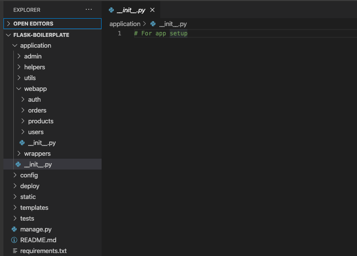

# Flask-Boilerplate-Managed-By-Techloset

Boilerplate for flask projects with best folder structure

# 1. Directory structure

Becaus Flask is a microframework it lets you decide on a lot of things. The structure of the Flask code is a personal view (or company view).

The directory structure that We recommend is:

<!-- ### A typical top-level directory layout -->

    ├── README.md
    ├── application
    │   ├── __init__.py
    │   ├── controllers
    │   │   └── __init__.py
    │   ├── forms
    │   │   └── __init__.py
    │   ├── models
    │   │   └── __init__.py
    │   ├── services
    │   │   └── __init__.py
    │   ├── static
    │   │   └── __init__.py
    │   ├── templates
    │   │   └── __init__.py
    │   └── utils
    │       └── __init__.py
    ├── config
    │   ├── __init__.py
    │   ├── default.py
    │   ├── development.py
    │   ├── development_sample.py
    │   ├── production.py
    │   ├── production_sample.py
    │   └── testing.py
    ├── deploy
    │   ├── flask_env.sh
    │   ├── gunicorn.conf
    │   ├── nginx.conf
    │   └── supervisor.conf
    ├── manage.py
    ├── pylintrc
    ├── requirements.txt
    ├── tests
    │   └── __init__.py
    └── wsgi.py

